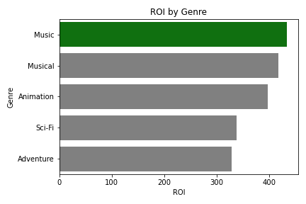
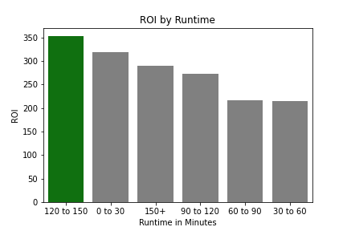

# Microsoft Film Analysis

**Author**: Samuel Marder

## Overview

This project aims to analyze film data to give Microsoft an edge when they decide to make a movie for the first time. Descriptive analysis of the movie data shows how Microsoft can best use the recent past of movies to get the best return on investment when it comes to making a movie. 

## Business Problem

The primary objective of this project is to help Microsoft figure out how best to invest in a new movie. To help with this objective I broke down the data by asking what would result i nthe highest return of investment and used that to make my recommendations.

## Data

The data used is from a well known movie database called IMDB which has information regarding various aspects of movies from who directed the movie to who wrote it. The sample contains movies from the recent past

## Methods

I took the data from IMDB and coorelated it with the information on movie budgets to get the return on investment because I felt that it would be the best approach

## Results


### Visual 1


### Visual 2


### Visual 3


## Conclusions

I would interpret these results by saying that there is a good cause to do an animated film with a feature length of 2 to 2.5 hours long given how much data is available for those aspects along with hiring Atsushi Wada to direct the film.

## For More Information

Please review our full analysis in the [Jupyter Notebook](./student.ipynb) or the [presentation](./presentation.pdf).

For any additional questions, please contact **name & email, name & email**

## Repository Structure

Describe the structure of your repository and its contents, for example:

```
├── README.md                <- The top-level README for reviewers of this project
├── student.ipynb            <- Narrative documentation of analysis in Jupyter notebook
├── presentation.pdf         <- PDF version of project presentation
└── images                   <- Both sourced externally and generated from code
```
